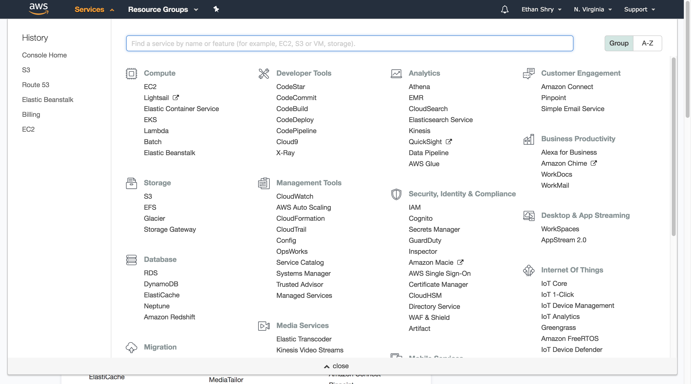
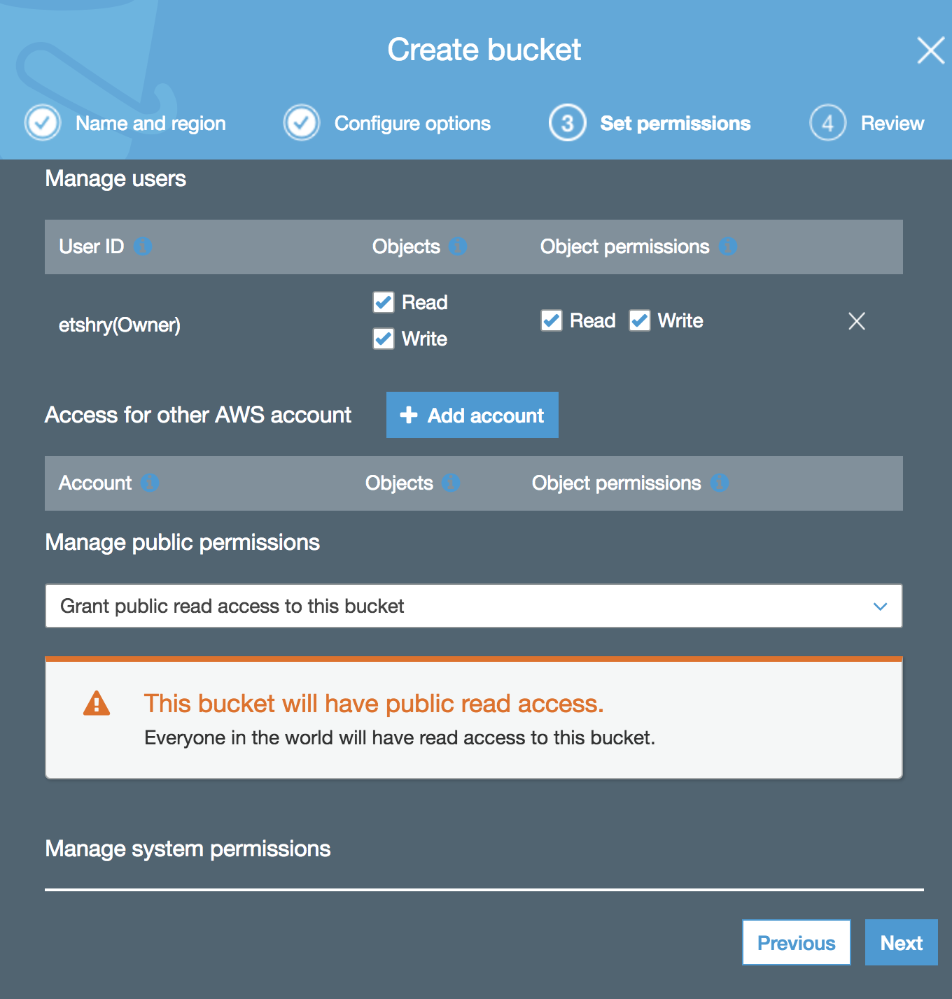
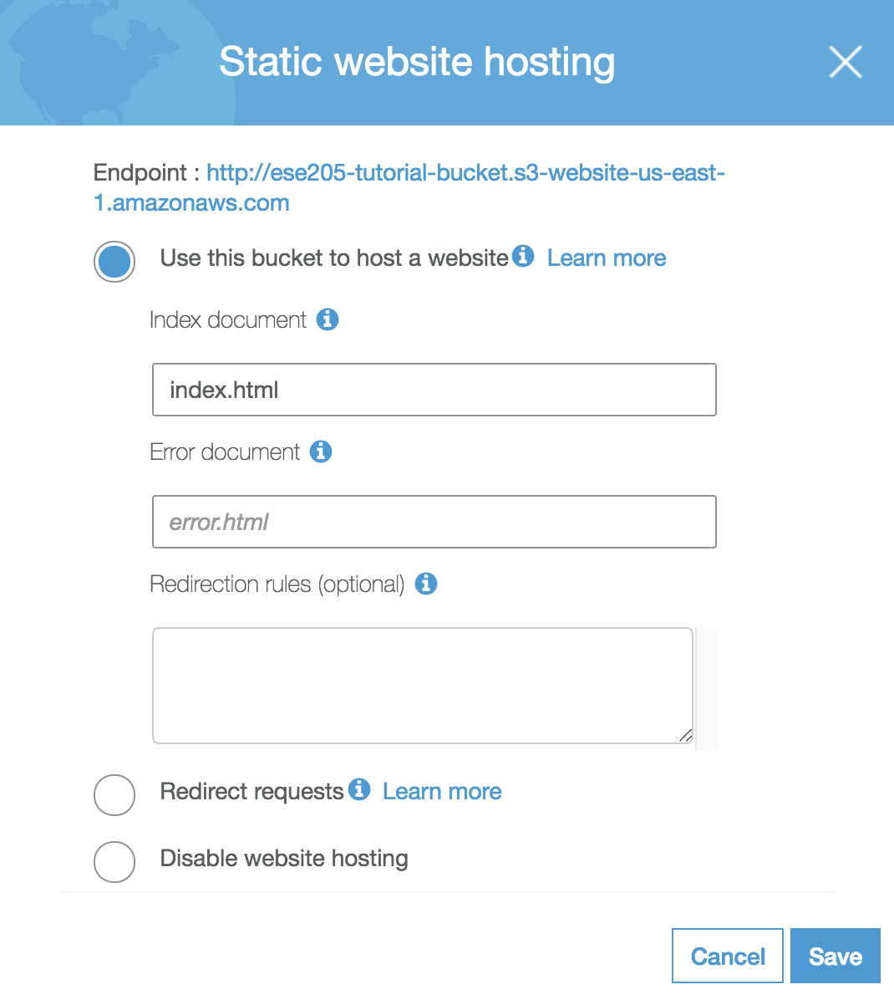
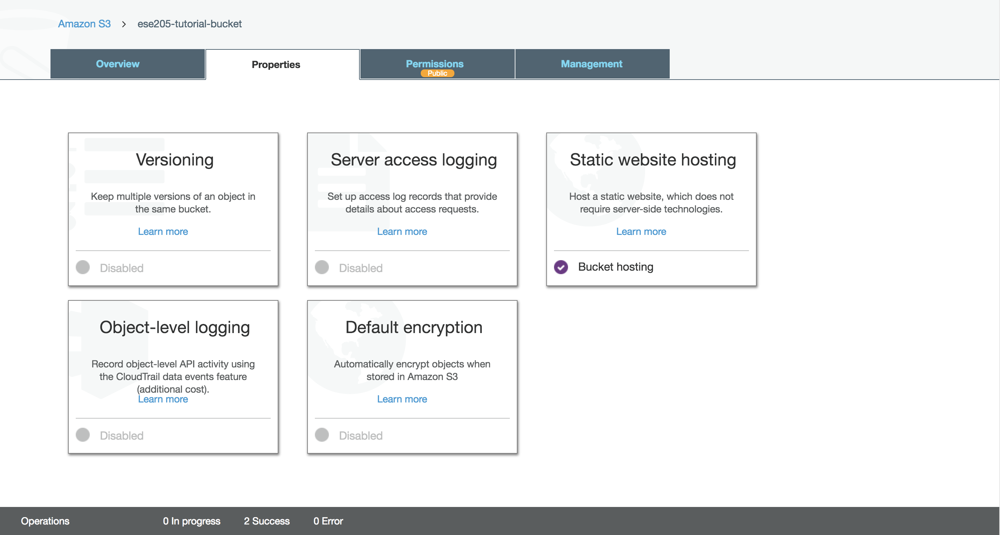
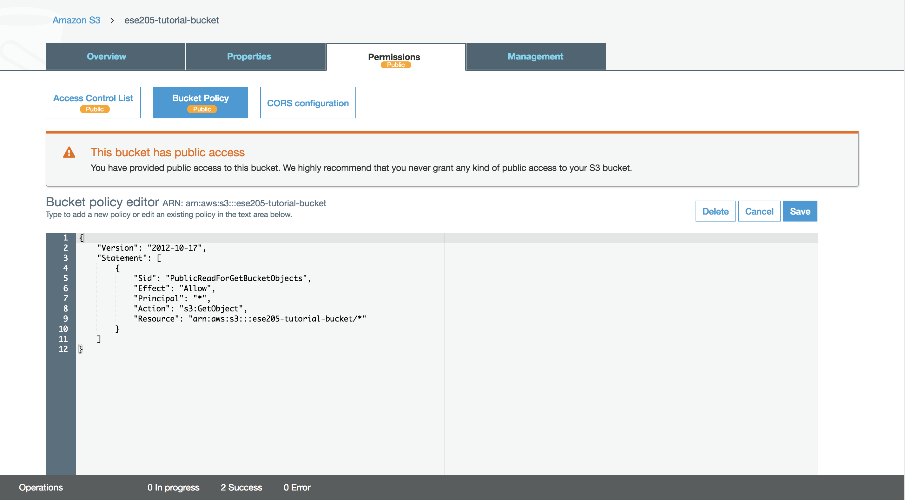
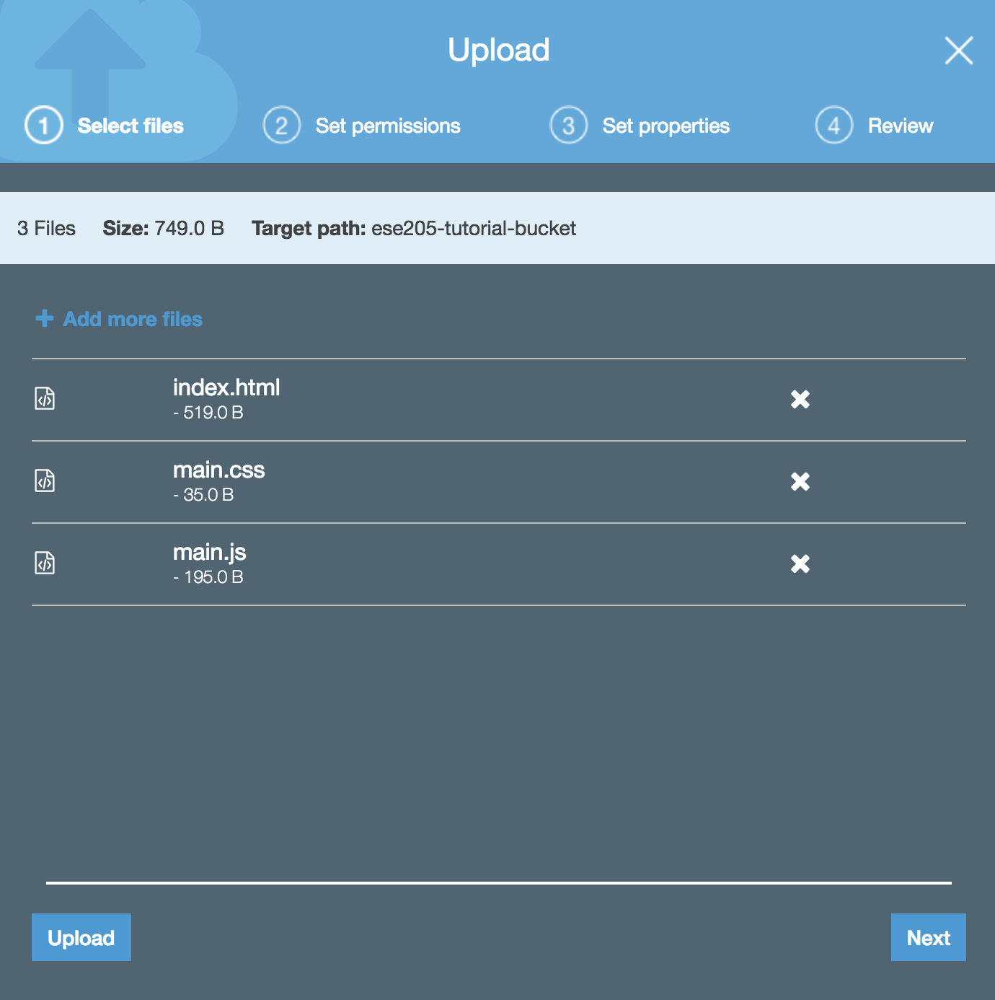

# Web: basic website with AWS S3

## Overview

TODO: flush out

## About S3

We will be using Amazon S3 (Simple Storage Service) to host a static website in the cloud. You can read more about S3 [here](https://aws.amazon.com/s3/).

S3 is essential a cloud file storage service. Typical use cases might include:

- File storage for access by other AWS services
- Storage of data files (i.e. `.csv`, `.tsv`, `.txt`) which you might want to process in the cloud or share amongst computers
- Storing AWS log data or other data outputted from AWS services
- As a collection of files referenced on a website (i.e. image or font hosting), like a CDN.

We will set up a bucket which will be used to host all of the `.html`, `.css`, and `.js` files used in our website.

## Setting up the bucket

This tutorial assumes you have an AWS account already. If you do not, go ahead and create an AWS account [here](https://portal.aws.amazon.com/billing/signup#/start)

Log in to AWS and navigate to **Services>Storage>S3**

TODO: highlight S3 in image



Click on **create bucket**.

You will then need to configure the bucket settings.

- Select a bucket name. This name will be part of your site URL, and must be unique across all buckets in S3. I will use **ese205-tutorial-bucket** as my bucket name.

Ignore the rest of the settings on this view and click **next**.

This is the Configure Options tab. All the settings here are irrelevant for now, so just click **next**.

Now we must set bucket permissions. It is very important that the permissions are set as follows:

- The bucket **OWNER** must have both **Read** and **Write** access.

- Under **Manage Public Permissions**, change from *Do not grant public read access to this bucket (Recommended)* to *Grand public read access to this bucket*. This is what will allow anyone to view your site.

Ensure that your permissions look like the following image, then click **next**.



In the review tab, verify everything is correct, especially that you have a *Bucket name* that you like, and that *Public permissions* are *Enabled*, and then click **Create Bucket**.

Congragulations, you've set up your first S3 bucket!

We have a few more steps before we can upload files to our site.

Open up your bucket by clicking on its name in the Buckets table.

Open the **Properties** tab.

Click on the **Static website hosting** card.

- Make a note of the *Endpoint*. This is the URL where your site will be published to. If you click on it right now, you will get a 404 error.

- Select the *Use this bucket to host a website* radio button, and enter a name for the *Index document*. This will be the name of the main html file that your site will navigate to when you open up your *Endpoint*.

Feel free to ignore all of the other options and click **Save**.




Now your site is configured to serve your content as a static website, as opposed to a collection of files.

Finally, we have to tell the bucket to allow access to all resources inside it to external users. This can be done on a file-by-file basis when files are uploaded, however for simplification we will just allow access to all files in the bucket all of the time.

Navigate to the **Permissions** tab, and click on **Bucket Policy**.

Then, paste the following code, being sure to replace *your-bucket-name* with your bucket name.

```json

{
    "Version": "2012-10-17",
    "Statement": [
        {
            "Sid": "PublicReadForGetBucketObjects",
            "Effect": "Allow",
            "Principal": "*",
            "Action": "s3:GetObject",
            "Resource": "arn:aws:s3:::your-bucket-name/*"
        }
    ]
}

```

Your screen should now look like this, and the **Bucket Policy** tab should now have a *Public* badge on it.



What we have just done is grant access to all the files in your bucket. **Anyone can now go to yourEndpoint/passwords.txt** and supposing you've uploaded a file called `passwords.txt` to your bucket, **they can view the contents of that file**. **NEVER** store sensitive data, such as **Passwords** or **API Keys Connected to paid services**, in your bucket under these settings.

You've successfully set up your bucket and configured it to host a website!

## Uploading Files

Now it's time to upload your site files. Feel free to use your own files, otherwise you can find some sample `html`, `css`, and `js` [here](https://github.com/ethanshry/ESE205TA/tree/master/webTutorials/staticSite)

Navigate to the **Overview** tab in your bucket.

Click **Upload**, and either drag in your files or select them from your drive.



Click **Upload**.

Wait for the upload to complete, and your're done! Navigate to your endpoint (found under **Properties>Static Website Hosting**), and assuming you've uploaded a file matching your *Index document* setting, you should see your site live!