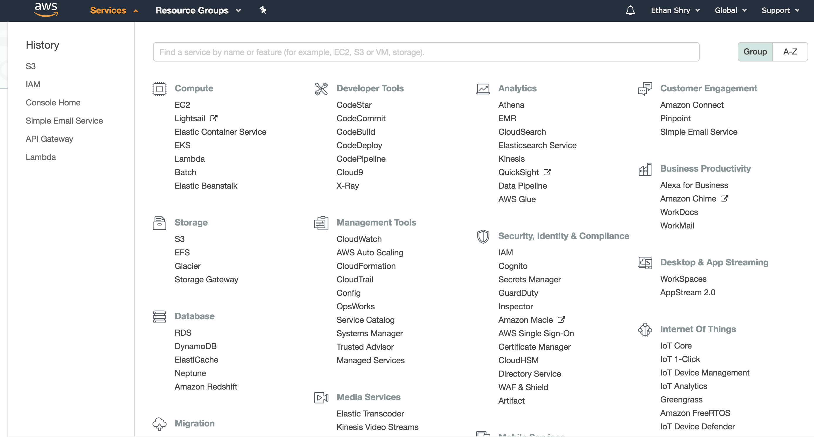
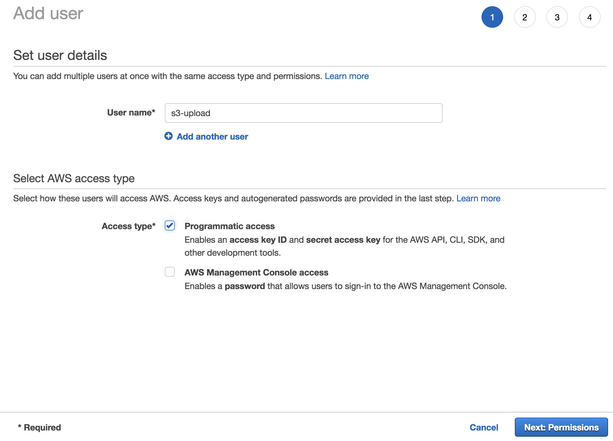
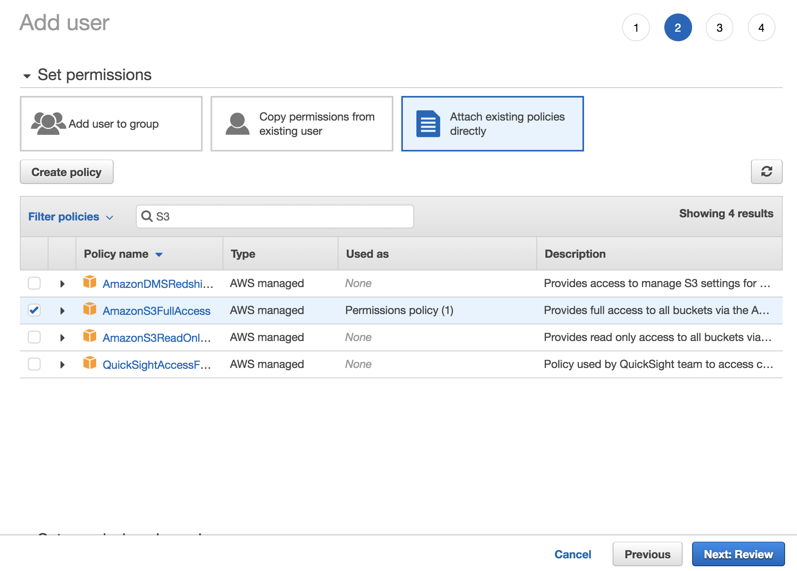
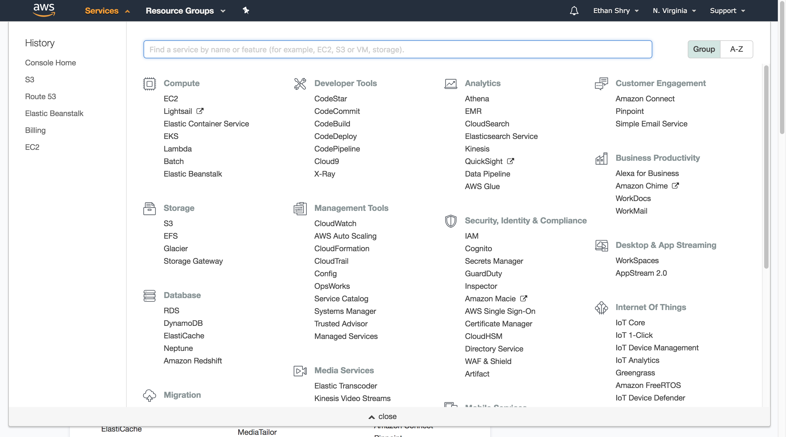

# Upload files to AWS S3 Programatically

## Overview

TODO: flush out

## About S3

We will be using Amazon S3 (Simple Storage Service) as a location to upload files to the cloud. You can read more about S3 [here](https://aws.amazon.com/s3/).

S3 is essential a cloud file storage service. Typical use cases might include:

- File storage for access by other AWS services
- Storage of data files (i.e. `.csv`, `.tsv`, `.txt`) which you might want to process in the cloud or share amongst computers
- Storing AWS log data or other data outputted from AWS services
- As a collection of files referenced on a website (i.e. image or font hosting), like a CDN.

We will set up a bucket which will be used to as the location to which we must upload our files, and then use the Boto3 python library, along with an IAM profile to upload files to that bucket.

## Setting up IAM roles

This tutorial assumes you have an AWS account already. If you do not, go ahead and create an AWS account [here](https://portal.aws.amazon.com/billing/signup#/start)

First, we need to set up an IAM profile. This is to get access to credentials which will allow you access to your site to upload files.

Log in to AWS and navigate to **Services >Security, Identity, and Compliance> IAM**

TODO: highlight IAM in image



In the left side panel, click on **Users**

Then click **Add User**

Now we will set up our IAM role.

First, define a username. This user's access will be restricted to uploading files to s3, so I'm going to use **s3-upload**

Since we will be uploading files programatically, under **Select AWS access type** choose **Programatic access**.

Ensure your user details are similiar to the following and click **Next**.



Now, we must grant our user access to a set of permissions. If desired, we can associate our user with a group and assign permissions to the group (which would be useful if you wanted to have several users uploading to s3), however in this instance we will attach policies directly.

Click on **Attach existing policies directly**, and then in the table find and select **AmazonS3FullAccess**.

Ensure your screen looks like the following and then click **Next**.



Review your user is configured as specified and click **Create user**.

You will now be presented with three pieces of information: your *User Name*, your *Access key ID*, and your *Secret access key*. Copy these down and click close.

**NOTE:** you should **NEVER** publicly reveal your *Access key ID* or *Secret access key*, on Github or anywhere else. An IAM role is granting access to your AWS account, and if your IAM role has been given enough permissions people can easily hack your account and create enormous charges under your name. If a credential breach is suspected, credentials should **IMMEDIATELY** be invalidated. We have had fraudulent AWS activity in this class which has nearly cost a group $**7200**. Please keep your credentials secure.

Finally, click on your newly created user in the Users table, and copy down the **USER ARN**.

Now that our IAM profile is set up, we will establish our S3 bucket.

## Setting up the bucket

Navigate to **Services>Storage>S3**

TODO: highlight S3 in image



Click on **create bucket**.

You will then need to configure the bucket settings.

- Select a bucket name. This must be unique across all buckets in S3. I will use **ese205-tutorial-bucket** as my bucket name.

Ignore the rest of the settings on this view and click **next**.

This is the Configure Options tab. All the settings here are irrelevant for now, so just click **next**.

Now we must set bucket permissions. Permissions should be as follows:

- The bucket **OWNER** should have both **Read** and **Write** access. This should be default behavior.

Click **next**.

In the review tab, verify everything is correct, especially that you have a *Bucket name* that you like, then click **Create Bucket**.

Congragulations, you've set up your first S3 bucket!

We have one more step before we can upload files to our bucket.

Open up your bucket by clicking on its name in the Buckets table.

Navigate to the **Permissions** tab, and click on **Bucket Policy**.

Then, paste the following code, being sure to replace *your-bucket-name* with your bucket name, and *user-arn* with your IAM user's ARN.

```json

{
    "Version": "2012-10-17",
    "Statement": [
        {
            "Effect": "Allow",
            "Principal": {
                "AWS": "user-arn"
            },
            "Action": "s3:PutObject",
            "Resource": "arn:aws:s3:::your-bucket-name/*"
        }
    ]
}

```

Be sure to click **Save**.

What we have just done is granted PutObject permissions to your IAM user for this specific bucket.

## Uploading Files

Now we'll upload our files.

You'll need both **Python** and **Boto3** installed. **Boto3** is the python package we use for interfacing with AWS, and can be installed with `pip install boto3`.

Then, we can upload our files. The code to do so is as follows:

```python

import boto3
# Create a Boto3 session obejct with your IAM user credentials
session = boto3.Session(
    aws_access_key_id='',
    aws_secret_access_key='',
)
# Ensure the region name matches the region of your bucket. us-east-1 matches US East (N. Virginia)
s3 = session.resource('s3', region_name='us-east-1')
# Replace bucket-name with your bucket name, as well as the name of the file you want displayed in your bucket, including the extension
object = s3.Object('bucket-name', 'file-name-for-bucket.extension')
# Put your local file into the bucket by replacing the path-to-local-file with your desired file to upload, including the file extension
object.put(Body=open('path-to-local-file.extension', 'rb'))

```

Now if you refresh your S3 bucket, you should see your uploaded file!